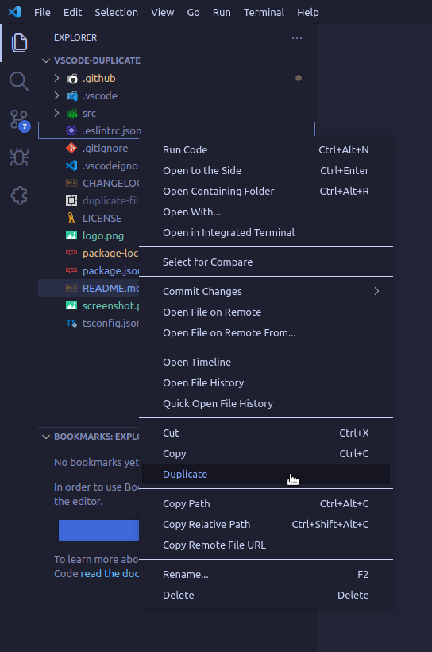

# vscode-duplicate

> VSCode Extension for duplicating files.

Easily duplicate files and directories in the explorer view:

You'll be asked a name for the copy. If a file with the chosen name does already exist you may choose to overwrite it.
Directories will not be overwritten.

## License

[MIT](LICENSE)

## Acknowledgements

- Icon used from [FeatherIcons](https://github.com/feathericons/feather)

- Logo generated using [IconKitchen](https://icon.kitchen/i/H4sIAAAAAAAAAzVQQW6EMAz8i3tFFVooqbiueq9UblVVGeIAaiA0cZauVvv3OqHNIRlNxh57bnBBGylAewON%2FqubaCFo2UcqwIxnO2%2FoOf0Gkgc0GYyWoYB5cKsQcjOt%2FDm47Qr3VNNdN%2BkA84Ijia4fz846L8xDWTaNMZl7mzCrwndEf8g6%2BuEoWLz4H8KOFxmuEHfS0JaPT3VdqVOtGqVq9VypQgb4617lc8zwilrP65h7uQ3aU1mAn8dJVkiwd8xuObAlk9lc92IMDSxpQJhQu12cOSUi3gZtIBEtTkebAnuHnXr4uP8Cj9hq%2BUMBAAA%3D)
